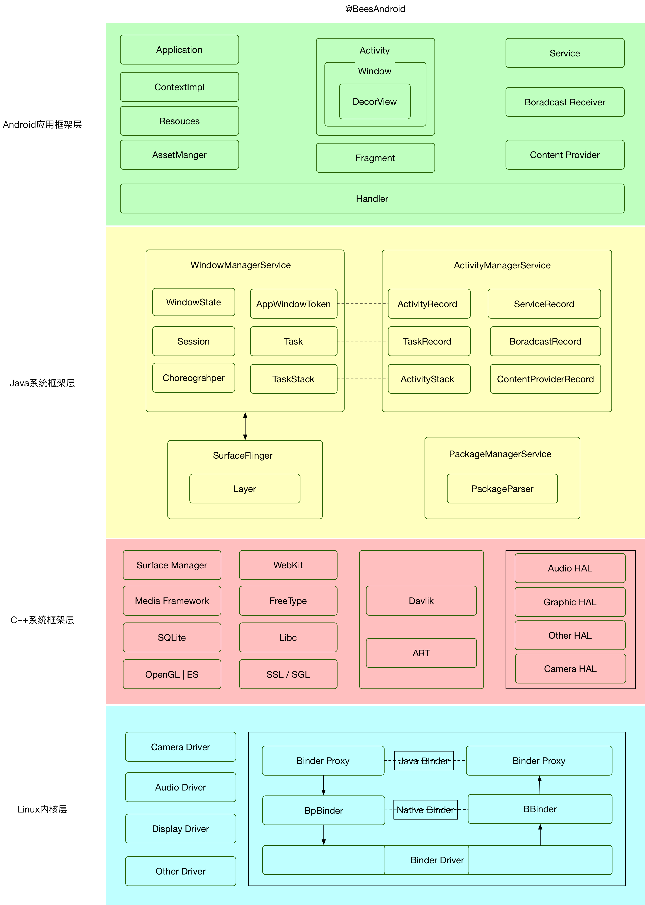

# Blog

## Catalog

- [基础](#基础)
  - [算法](#算法)
  - [设计模式](#设计模式)
- [Java](#Java)
  - [集合](#集合)
  - [并发](#并发)
- [Android](#Android)
  - [基础篇](#基础篇)
  - [原理篇](#原理篇)
  - [核心篇](#核心篇)
  - [开源篇](#开源篇)
  - [蓝牙篇](#蓝牙篇)
- [Go](#Go)
  - [交叉编译](#交叉编译)
- [VPS](#VPS)
  - [Linux](#Linux)
  - [Ubuntu](#ubuntu)
  - [Centos](#centos)
  - [Nginx](#nginx)
- [Tool](#Tool)
  - [Mysql](#Mysql)
  - [Git](#git)
    - [设置 Git 代理](#设置-Git-代理)
    - [Commit Message 规范](#Commit-Message-规范)
  - [Vim](#vim)
  - [ADB](#adb)
  - [Shadowsocks](https://github.com/itwangxiang/docs/wiki/VPS.Shadowsocks)
- [Asset](#asset)

---

## 基础

### 算法

#### 排序算法

> 对一序列对象根据某个关键字进行排序

##### 冒泡排序

```java
public static void bubbleSort(int[] array) {
    for (int i = 0; i < array.length; i++)
        for (int j = 0; j < array.length - i - 1; j++)
            if (array[j + 1] < array[j]) {
                int temp = array[j + 1];
                array[j + 1] = array[j];
                array[j] = temp;
            }
}
```

##### 选择排序

```java
public static void selectionSort(int[] arr) {
    int min, temp;
    for (int i = 0; i < arr.length; i++) {
        // 初始化未排序序列中最小数据数组下标
        min = i;
        for (int j = i + 1; j < arr.length; j++) {
            // 在未排序元素中继续寻找最小元素，并保存其下标
            if (arr[j] < arr[min]) {
                min = j;
            }
        }
        // 将未排序列中最小元素放到已排序列末尾
        if (min != i) {
            temp = arr[min];
            arr[min] = arr[i];
            arr[i] = temp;
        }
    }
}
```

##### 快速排序

```java
public static void quickSort(int[] arr, int head, int tail) {
    if (head >= tail || arr == null || arr.length <= 1) {
        return;
    }
    int i = head, j = tail, pivot = arr[(head + tail) / 2];
    while (i <= j) {
        while (arr[i] < pivot) {
            ++i;
        }
        while (arr[j] > pivot) {
            --j;
        }
        if (i < j) {
            int t = arr[i];
            arr[i] = arr[j];
            arr[j] = t;
            ++i;
            --j;
        } else if (i == j) {
            ++i;
        }
    }
    quickSort(arr, head, j);
    quickSort(arr, i, tail);
}
```

### 设计模式

[todo](https://github.com/itwangxiang/docs/issues/1)

#### 创建型

- 工厂方法模式 `Factory Method Pattern`
  - UML 图
  
  - Code
    - [FactoryMethodPattern.java](code/java/src/cn/todev/examples/pattern/FactoryMethodPattern.java)
  - Java 中用例
    - [java.util.Calendar](https://docs.oracle.com/javase/8/docs/api/java/util/Calendar.html#getInstance--)


- 建造者模式 `Builder Pattern`
- 单例模式 `Singleton Pattern`

#### 结构型

#### 行为型


## Java

### 集合

#### 非线程安全集合

- `List`: 有序集合
  - ArrayList
    - 数据结构：`基于泛型数组`
    - 特点：查询速度快，增删速度慢
  - LinkedList
    - 数据结构：`基于链表结构`
    - 特点：查询速度慢，增删速度快
- `Map`: 将键映射到值的双列集合
  - HashMap
    - 数据结构： `基于哈希表`
    - 特点：存取无序
    - 源码
      - `DEFAULT_INITIAL_CAPACITY` 默认为 16
      - `MAXIMUM_CAPACITY` 默认为 2 的 30 次幂
      - `DEFAULT_LOAD_FACTOR` 默认负载因子 0.75
      - 每次会扩容长度为以前的2倍
  - TreeMap
    - 有序
    - 数据结构 -> `基于红黑树`
  - LinkedHashMap
    - 数据结构： `基于链表和哈希表`
    - 特点：存取有序
  - EnumMap: 
    - 特点：枚举类型作为键值的Map
  - IdentityHashMap: 
    - 特点：使用 “==” 来比较引用
  - WeakHashMap: 
    - 特点：将键存储在 WeakReference 中
    - 场景：用于数据缓存中
- `Set`: 不能包含重复元素的集合
  - HashSet: 
    - 数据结构： `基于哈希表`
    - 特点：存取无序
  - TreeSet
    - 数据结构： `基于二叉树`
    - 特点：排序
  - LinkedHashSet
    - 数据结构： `基于链表和哈希表`
    - 特点：存取有序
  - EnumSet: 
    - 特点：值为枚举类型的Set
  - BitSet
- `Queue/Deque`: 队列
  - ArrayDeque
    - 特点：基于有首尾指针的数组（环形缓冲区）
  - PriorityQueue
    - 特点：基于优先级的队列

#### 线程安全集合

- `List`
  - CopyOnWriteArrayList
    - 特点：避免了多线程操作的线程安全问题
    - 原理：先复制，再操作，最后替换
    - 场景：用在遍历操作比更新操作多的集合，比如 listeners / observers 集合
- `Queue/Deque`
  - ArrayBlockingQueue
    - 特点：基于数组实现的一个有界阻塞队，大小不能重新定义
  - ConcurrentLinkedQueue
    - 特点：基于链表实现的无界队列
  - DelayQueue
  - LinkedBlockingQueue / LinkedBlockingDeque
    - 特点：可选择有界或者无界基于链表的实现
  - LinkedTransferQueue
    - 特点：基于链表的无界队列
  - SynchronousQueue
    - 特点：有界队列
- `Map`   
  - ConcurrentHashMap
  - ConcurrentSkipListMap 
    - `并发有序`  
- `Set`  
  - ConcurrentSkipListSet
  - CopyOnWriteArraySet   

### 并发

#### 线程

- 创建
  - 继承 `Thread` 并重写 `run()` 方法 - [ThreadExample.java](code/java/src/cn/todev/examples/concurrency/ThreadExample.java)
  ```java
  public class ThreadExample extends Thread {

    // run() method contains the code that is executed by the thread.
    @Override
    public void run() {
        System.out.println("Inside : " + Thread.currentThread().getName());
    }

    public static void main(String[] args) {
        System.out.println("Inside : " + Thread.currentThread().getName());

        System.out.println("Creating thread...");
        Thread thread = new ThreadExample();

        System.out.println("Starting thread...");
        thread.start();
    }
  }
  ```
  - 实现 `Runnable` 接口 - [RunnableExample.java](code/java/src/cn/todev/examples/concurrency/RunnableExample.java)  
  ```java
  public class RunnableExample implements Runnable {

    public static void main(String[] args) {
        System.out.println("Inside : " + Thread.currentThread().getName());

        System.out.println("Creating Runnable...");
        Runnable runnable = new RunnableExample();

        System.out.println("Creating Thread...");
        Thread thread = new Thread(runnable);

        System.out.println("Starting Thread...");
        thread.start();
    }

    @Override
    public void run() {
        System.out.println("Inside : " + Thread.currentThread().getName());
    }
  }
  ```  
  - 内部类实现 - [RunnableExampleAnonymousClass.java](code/java/src/cn/todev/examples/concurrency/RunnableExampleAnonymousClass.java)  
  ```java
  public class RunnableExampleAnonymousClass {

    public static void main(String[] args) {
        System.out.println("Inside : " + Thread.currentThread().getName());

        System.out.println("Creating Runnable...");
        Runnable runnable = new Runnable() {
            @Override
            public void run() {
                System.out.println("Inside : " + Thread.currentThread().getName());
            }
        };

        System.out.println("Creating Thread...");
        Thread thread = new Thread(runnable);

        System.out.println("Starting Thread...");
        thread.start();
    }
  }
  ```
- 休眠
  - 使用 `sleep()`
- 等待
  - 使用 `join()`

#### `ExecutorService` 和 `Thread Pools`

- Executors 框架
  - 优点
    - 线程创建
    - 线程管理
    - 任务提交和执行
  - 方法
    - `execute` - 执行任务
    - `submit` - 提交任务
    - `shutdown()` - 停止接受新任务，等待先前提交的任务执行，然后终止执行程序
    - `shutdownNow()` - 中断正在运行的任务并立即关闭执行程序
  - Code - - [ExecutorsExample.java](code/java/src/cn/todev/examples/concurrency/ExecutorsExample.java) 
  ```java
  import java.util.concurrent.ExecutorService;
  import java.util.concurrent.Executors;
  import java.util.concurrent.TimeUnit;

  public class ExecutorsExample {
      public static void main(String[] args) {
          System.out.println("Inside : " + Thread.currentThread().getName());

          System.out.println("Creating Executor Service with a thread pool of Size 2");
          ExecutorService executorService = Executors.newFixedThreadPool(2);

          Runnable task1 = () -> {
              System.out.println("Executing Task1 inside : " + Thread.currentThread().getName());
              try {
                  TimeUnit.SECONDS.sleep(2);
              } catch (InterruptedException ex) {
                  throw new IllegalStateException(ex);
              }
          };

          Runnable task2 = () -> {
              System.out.println("Executing Task2 inside : " + Thread.currentThread().getName());
              try {
                  TimeUnit.SECONDS.sleep(4);
              } catch (InterruptedException ex) {
                  throw new IllegalStateException(ex);
              }
          };

          Runnable task3 = () -> {
              System.out.println("Executing Task3 inside : " + Thread.currentThread().getName());
              try {
                  TimeUnit.SECONDS.sleep(3);
              } catch (InterruptedException ex) {
                  throw new IllegalStateException(ex);
              }
          };


          System.out.println("Submitting the tasks for execution...");
          executorService.submit(task1);
          executorService.submit(task2);
          executorService.submit(task3);

          //executorService 会一直监听新的任务（即阻塞线程），直到关闭他为止
          executorService.shutdown();
      }
  }
  ```

- 线程池 
  - 简介：与 `Runnable` 或 `Callable` 任务分开存在的一堆工作线程，由 `executorService` 管理
  - 机制：任务通过 `Blocking Queue` 提交到线程池
    - 如果任务的数量大过活动线程数量，则会将他插入 `Blocking Queue` 中，一直等到有可用线程为止
    - 如果 `Blocking Queue` 已满，则拒绝新任务
  - Code 
    - [ScheduledExecutorsExample.java](code/java/src/cn/todev/examples/concurrency/ScheduledExecutorsExample.java)
    - [ScheduledExecutorsPeriodicExample.java](code/java/src/cn/todev/examples/concurrency/ScheduledExecutorsPeriodicExample.java)

- `Callable` 与 `Future`
  - 方法
    - `cancel()`: 尝试取消执行任务，如果成功取消则返回true，否则返回false
    - `cancel(boolean mayInterruptIfRunning)`: 当 mayInterruptIfRunning 为 true 时，则当前正在执行任务的线程将被中断，否则将允许正在进行的任务完成
    - `isCancelled`: 任务是否被取消
    - `isDone`: 任务是否已完成
  - Code - [FutureAndCallableExample.java](code/java/src/cn/todev/examples/concurrency/FutureAndCallableExample.java)

## Android

### 系统架构图



### 基础篇

- 四大组件

  - Activity
    - [生命周期](https://developer.android.com/guide/components/activities/activity-lifecycle#java)
      > onCreate -> onStart -> onResume -> onPause -> onStop -> onDestory
    - [启动模式](https://developer.android.com/guide/components/activities/tasks-and-back-stack#TaskLaunchModes)
      - standard
      - singleTop
      - singleTask
      - singleInstance
  - Service
    - startService
      > `onCreate()` 、`onStartCommand()`、`onStart()`、`onDestroy()`
    - bindService
      > `bindService()`、`onCreate()` 、`IBinder onBind(Intent intent)`、`unBindService()`、`onDestroy()`
  - BroadcastReceiver
    - 作用：从 Android 系统和其他 Android 应用程序发送或接收广播消息
    - 注册方式：静态/动态
    - 类型
      - 普通广播 `Normal Broadcast`
      - 系统广播 `System Broadcast`
      - 有序广播 `Ordered Broadcast`
      - 粘性广播 `Sticky Broadcast`
      - 应用内广播 `Local Broadcast`
  - Content Provider

- 布局

  - LinearLayout
  - RelativeLayout
  - FrameLayout
  - TableLayout

- 其他
  - AlertDialog,popupWindow,Activity 的区别
  - Application 和 Activity 的 Context 对象的区别
  - BroadcastReceiver，LocalBroadcastReceiver 的区别

### 原理篇

- Touch 事件传递机制

  - ViewGroup : `dispatchTouchEvent()` -> `onInterceptTouchEvent() == true` -> `onTouchListener.onTouch()` -> `onTouchEvent()` -> `onClick`
  - View : `dispatchTouchEvent()` -> `onTouchListener.onTouch()` -> `onTouchEvent()` -> `onClick`

- 屏幕刷新机制

  - Android 应用程序调用 SurfaceFlinger 服务把经过测量、布局和绘制后的 Surface 渲染到显示屏幕上

  - `参考资料`
    - [Android 显示原理简介](http://djt.qq.com/article/view/987)

- `Handler`

  - 流程
    - 等待消息：Looper.loop();
    - 消息入队：
      1. Handler.sendMessage(msg)
      2. Looper.MessageQueue.enqueueMessage(msg)
    - 处理消息：Looper.loop();
    - 消息出队：
      1. Handler.dispatchMessage(msg)
      2. Handler.handleMessage(msg)

- `AsyncTask` [Doc](https://developer.android.com/reference/android/os/AsyncTask)

  > `AsyncTask` 可以正确，方便地使用 UI 线程。此类允许您执行后台操作并在 UI 线程上发布结果，而无需操作线程和/或处理程序

- `ActivityThread`

  它管理应用程序进程中主线程的执行，按照活动管理器的请求调度和执行活动、广播和其他操作

  1. LauncherActivity 通过 Binder 进程间通信的方式将应用的信息通过 Intent 的方式传递给 AMS ，由 AMS 进行调度。
  2. 如果系统中不存在该进程时，AMS 将会请求 Zygote 服务去 fork 一个子进程，成功后返回一个 pid 给 AMS，并由 AndroidRuntime 机制调起 ActivityThread 中的 main() 方法。
  3. 紧接着，应用程序的 Main Looper 被创建，ActivityThread 被实例化成为对象并将 Application 的信息以进程间通信的方式再次回馈给 AMS。
  4. AMS 接收到客户端发来的请求数据之后，首先将应用程序绑定，并启动应用程序的 Activity，开始执行 Activity 的生命周期

- `ThreadLocal`
- `LruCache` 缓存策略

  > 包含对有限数量值的强引用的缓存。每次访问一个值时，它都会移动到队列的头部。将值添加到完整缓存时，该队列末尾的值将被逐出，并且可能符合垃圾回收的条件

  - 原理：
    - `LruCache` 中维护了一个 `LinkedHashMap` 集合并将其设置顺序排序。
    - 当调用 `put()` 方法时，就会在集合中添加元素，并调用 `trimToSize()` 判断缓存是否已满，如果满了就用 `LinkedHashMap` 的迭代器删除队尾元素，即近期最少访问的元素。
    - 当调用 `get()` 方法访问缓存对象时，就会调用 `LinkedHashMap` 的 `get()` 方法获得对应集合元素，同时会更新该元素到队头

- ANR 产生的原因，以及如何定位和修正
- OOM 是什么？以及如何避免？
- 内存泄漏和内存溢出区别？
- 为什么不能在子线程更新 UI

### 优化篇

- 内存优化
- UI 优化
- 网络优化
- 启动优化
- 电量优化

> 参考资料

- [Android 性能优化全方面解析](https://juejin.im/post/5a0d30e151882546d71ee49e#heading-17)

### 视频篇

### 网络篇

### 开源篇

- [OkHttp](https://github.com/square/okhttp)

  > 适用于 Android 和 Java 应用程序的 HTTP + HTTP/2 客户端

  - OkHttp 支持同步调用和异步调用
  - OkHttp 提供了对最新的 HTTP 协议版本 HTTP/2 和 SPDY 的支持，这使得对同一个主机发出的所有请求都可以共享相同的套接字连接
  - 如果 HTTP/2 和 SPDY 不可用，OkHttp 会使用连接池来复用连接以提高效率
  - OkHttp 提供了对 GZIP 的默认支持来降低传输内容的大小
  - OkHttp 也提供了对 HTTP 响应的缓存机制，可以避免不必要的网络请求
  - 当网络出现问题时，OkHttp 会自动重试一个主机的多个 IP 地址

- Retrofit [官网](https://github.com/square/retrofit)

  > 适用于 Android 和 Java 的类型安全的 HTTP 客户端

  - 默认基于 OkHttp 封装的一套 RESTful 网络请求框架
  - 通过注解直接配置请求
  - 使用不同 Json Converter 来序列化数据
  - 提供对 RxJava 的支持

- Glide [官网](https://github.com/bumptech/glide)

  > Glide 是一个快速高效的 Android 图片加载库，注重于平滑的滚动

  - Glide 支持拉取，解码和展示视频快照，图片，和 GIF 动画
  - Glide 使用简明的流式语法 API

- ButterKnife [官网](https://github.com/JakeWharton/butterknife)

  > 将 Android 视图和回调绑定到字段和方法

  - 通过在字段上使用 `@BindView` 消除 `findViewById` 回调
  - 在列表或数组中组合多个视图。一次性使用操作，设置器或属性操作它们
  - 通过使用`@OnClick`和其他方法注释方法来消除侦听器的匿名内部类
  - 通过在字段上使用资源注释来消除资源查找

- Rxjava [官网](https://github.com/ReactiveX/RxJava)

  > RxJava - JVM 的 Reactive Extensions - 一个使用 Java VM 的可观察序列组成异步和基于事件的程序的库

  - 基于事件流的链式调用、逻辑简洁 & 使用简单
  - 扩展了观察者模式，以支持数据/事件序列，并增加了操作符，他可以将将序列清晰的组合在一起的

- Logger [官网](https://github.com/orhanobut/logger)

  > 简单，漂亮，功能强大的 android 记录器

- EventBus [官网](https://github.com/greenrobot/EventBus) - [源码](docs/source/EventBus.md)

  > 适用于 Android 和 Java 的事件总线，可简化 Activities, Fragments, Threads, Services 等之间的通信。减少代码，提高质量

- 批量渠道打包 
    
    - [AndroidMultiChannelBuildTool](https://github.com/GavinCT/AndroidMultiChannelBuildTool)

### 蓝牙篇

#### 低功耗蓝牙 `Bluetooth Low Energy` - [官网](https://developer.android.com/guide/topics/connectivity/bluetooth-le)
- 关键术语和概念
  - 通用属性配置文件 `Generic Attribute Profile` (GATT) - GATT 配置文件是一种通用规范，内容针对在 BLE 链路上发送和接收称为“属性”的简短数据片段
  - 属性协议 `Attribute Protocol ` (ATT) — 属性协议 (ATT) 是 GATT 的构建基础，二者的关系也被称为 GATT/ATT
  - 特征 `Characteristic` — 特征包含一个值和 0 至 n 个描述特征值的描述符
  - 描述符 `Descriptor` — 描述符是描述特征值的已定义属性
  - 服务 `Service` - 服务是一系列特征
- 使用流程
  - 设置 `BLE`
    - 获取 `BluetoothAdapter`
    - 启用蓝牙
    ```kotlin
    val enableBtIntent = Intent(BluetoothAdapter.ACTION_REQUEST_ENABLE)
    startActivityForResult(enableBtIntent, REQUEST_ENABLE_BT)
    ```
  - 查找 `BLE` 设备
    - 方法
      - `startLeScan(BluetoothAdapter.LeScanCallback)` - 查找 BLE 设备
      - `startLeScan(UUID[], BluetoothAdapter.LeScanCallback)` - 扫描特定类型的外围设备
    - 注意事项(由于扫描非常耗电)
      - 找到所需设备后，立即停止扫描
      - 绝对不进行循环扫描，并设置扫描时间限制
    - Code
    ```kotlin
    private var mScanning: Boolean = false

    //返回扫描结果
    private val leScanCallback = BluetoothAdapter.LeScanCallback { device, rssi, scanRecord ->
        runOnUiThread {
            //todo
        }
    }

    //在预定义的扫描时间段后停止扫描
    handler.postDelayed({
        mScanning = false
        bluetoothAdapter.stopLeScan(leScanCallback)
    }, 10000)
    mScanning = true
    bluetoothAdapter.startLeScan(leScanCallback)
    ```
  - 连接 GATT 服务器
    - 方法 `BluetoothGatt connectGatt (Context context, boolean autoConnect, BluetoothGattCallback callback)`
    - Code
    ```kotlin
    private val gattCallback = object : BluetoothGattCallback() {
        override fun onConnectionStateChange(
                gatt: BluetoothGatt,
                status: Int,
                newState: Int
        ) {

        }

        // New services discovered
        override fun onServicesDiscovered(gatt: BluetoothGatt, status: Int) {
            when (status) {
                BluetoothGatt.GATT_SUCCESS -> broadcastUpdate(ACTION_GATT_SERVICES_DISCOVERED)
                else -> Log.w(TAG, "onServicesDiscovered received: $status")
            }
        }

        // Result of a characteristic read operation
        override fun onCharacteristicRead(
                gatt: BluetoothGatt,
                characteristic: BluetoothGattCharacteristic,
                status: Int
        ) {
            when (status) {
                    BluetoothGatt.GATT_SUCCESS -> {
                        broadcastUpdate(ACTION_DATA_AVAILABLE, characteristic)
                    }
            }
        }

        // Characteristic notification
        override fun onCharacteristicChanged(
                gatt: BluetoothGatt,
                characteristic: BluetoothGattCharacteristic
        ) {
            broadcastUpdate(ACTION_DATA_AVAILABLE, characteristic)
        }
    }
    ```
  - 读取 BLE 属性
  - 接收 GATT 通知 - `setCharacteristicNotification()`
  - 关闭客户端应用 - `close()`


## Go

### 交叉编译

Mac 下编译

```bash
CGO_ENABLED=0 GOOS=linux GOARCH=amd64 go build main.go
CGO_ENABLED=0 GOOS=windows GOARCH=amd64 go build main.go
```

Linux 下编译

```bash
# mac
CGO_ENABLED=0 GOOS=darwin GOARCH=amd64 go build main.go
# windows
CGO_ENABLED=0 GOOS=windows GOARCH=amd64 go build main.go
```

Windows 下编译

```bash
# mac
SET CGO_ENABLED=0
SET GOOS=darwin
SET GOARCH=amd64
go build main.go

#linux
SET CGO_ENABLED=0
SET GOOS=linux
SET GOARCH=amd64
go build main.go
```


## VPS

### Linux

- [概要](docs/vps/linux.md)
  
  后台任务，杀掉

### Ubuntu

- [概要](docs/vps/ubuntu.md)

### Centos

- [概要](docs/vps/centos.md)
  
  修改密码、搭建 Shadowsocks、设置防火墙

### Nginx

- [概要](docs/vps/nginx.md)

## Tool

### MySql

- [概要](docs/tool/mysql.md)

### Git

#### [概要](docs/tool/git.md)

#### 设置 Git 代理
- 设置
  ```bash
  git config --global http.proxy http://127.0.0.1:1087
  git config --global https.proxy https://127.0.0.1:1087

  # 只对 github.com
  git config --global http.https://github.com.proxy http://127.0.0.1:1087
  git config --global https.https://github.com.proxy https://127.0.0.1:1087
  ```
- 取消
  ```bash
  git config --global --unset http.proxy
  git config --global --unset https.proxy

  # github.com
  git config --global --unset http.https://github.com.proxy
  git config --global --unset https.https://github.com.proxy
  ```
- 设置终端临时代理

  ```bash
  export http_proxy=http://127.0.0.1:1080
  export https_proxy=http://127.0.0.1:1080
  curl https://www.google.com # 测试
  ```
#### [Commit Message 规范](docs/tool/git-commit-message-specification.md)
```bash
<type>[optional scope]: <description>

[optional body]

[optional footer(s)]
```
```bash
# head: <type>(<scope>): <subject>
# - type: feat, fix, docs, style, refactor, test, chore
# - scope: can be empty (eg. if the change is a global or difficult to assign to a single component)
# - subject: start with verb (such as 'change'), 50-character line
#
# body: 72-character wrapped. This should answer:
# * Why was this change necessary?
# * How does it address the problem?
# * Are there any side effects?
#
# footer: 
# - Include a link to the ticket, if any.
# - BREAKING CHANGE
#
```

### Vim

- [概要](docs/tool/vim.md)

### ADB

- 常规
  
  ```bash
  adb tcpip 5555 //设置远程设备监听端口
  adb connect ip:port //连接远程设备
  adb reconnect //重新连接设备
  adb shell am start -n ｛package｝/.{activity} //启动程序
  adb shell setprop persist.service.adb.tcp.port 5555 //设置系统重启后，远程设备监听端口
  adb shell wifitest -z "W 00:1f:2e:3d:4c:5b" //设置 WI-FI MAC
  adb shell wifitest -z "B 00:1f:2e:3d:4c:5b" //设置 蓝牙 MAC
  ```

## Asset

- [Window 下设置 JAVA 环境变量](asset/set-jdk-env-variables.ps1)
- [Pac.txt](asset/pac.txt)
